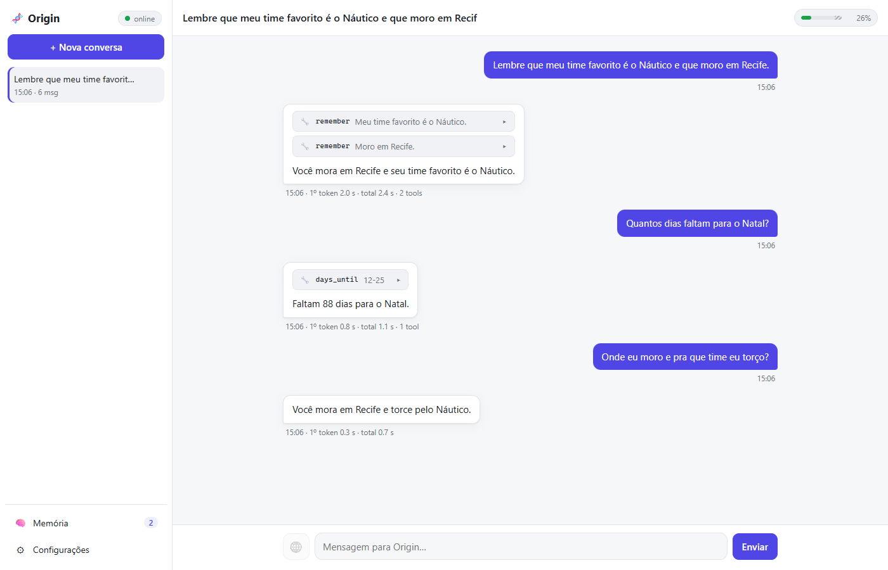
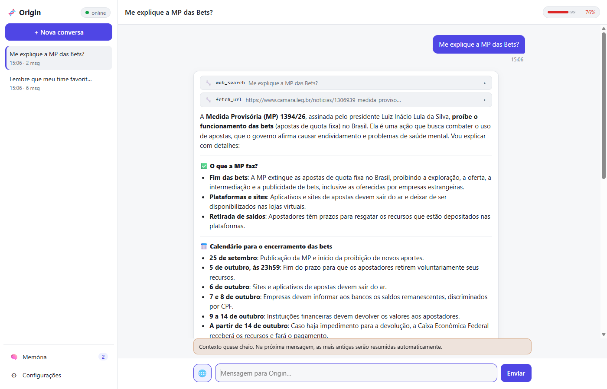
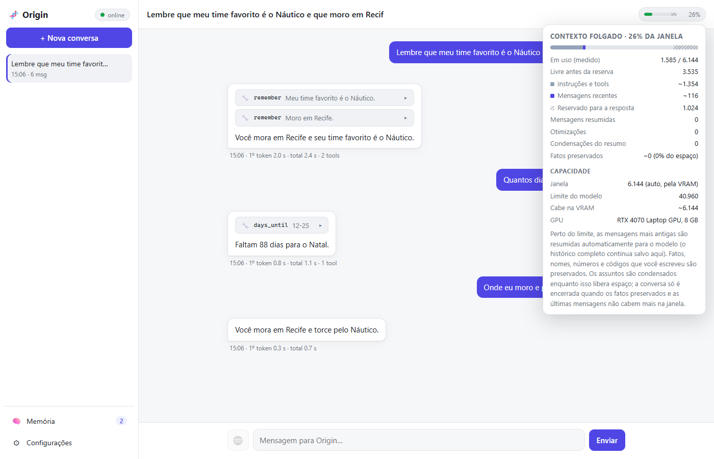
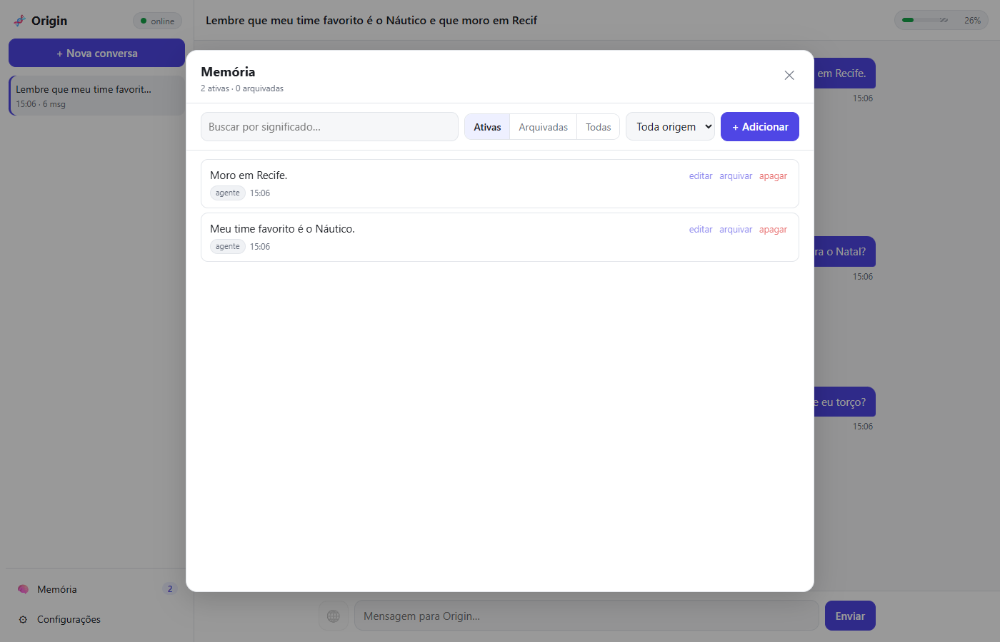
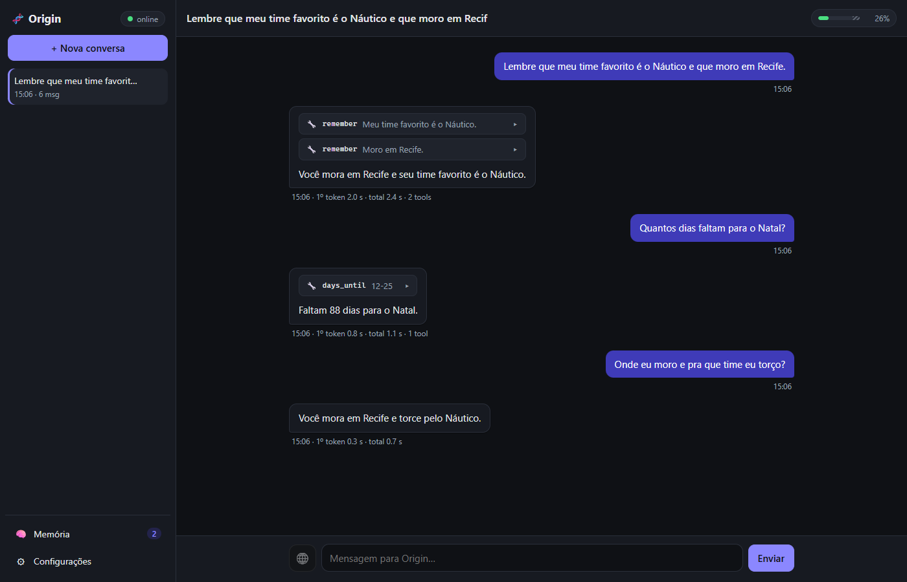
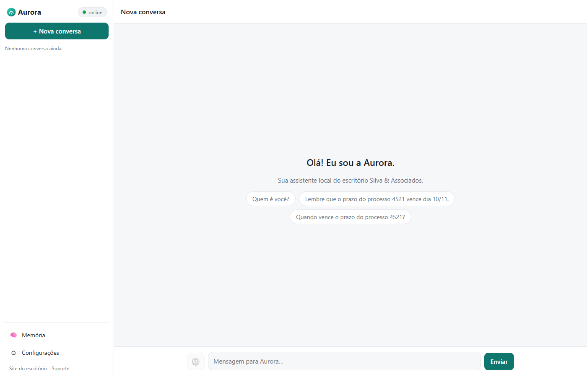
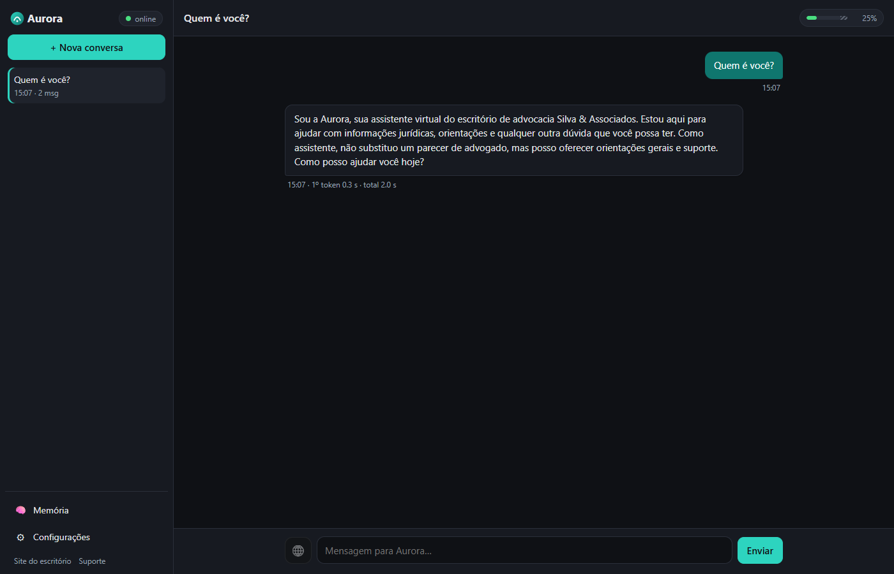
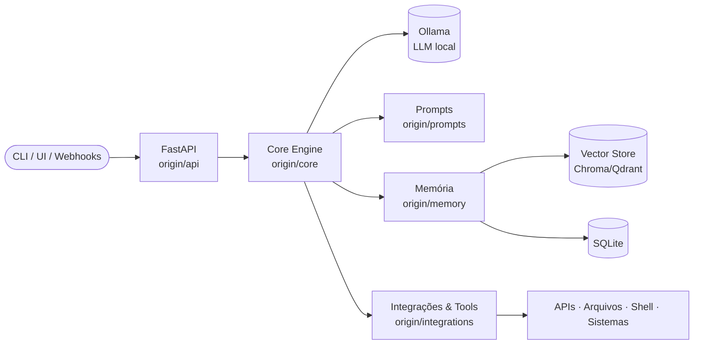

<div align="center">

# 🧬 Origin

**A fundação open source para assistentes de IA pessoais — 100% local, modular e sua.**

[](https://github.com/igorston/origin-ai/actions/workflows/ci.yml)
[](https://www.python.org/)
[](https://fastapi.tiangolo.com/)
[](https://www.langchain.com/)
[](https://ollama.com/)
[](https://github.com/astral-sh/ruff)
[](LICENSE)
[](#roadmap)
[](https://github.com/igorston/origin-ai/pulls)



</div>

---

## Por que Origin?

Seus dados, seus modelos, sua máquina. O **Origin** é um núcleo de IA que roda inteiramente na sua máquina, sobre LLMs locais (via Ollama): conversas, memória e modelos não vão para a nuvem. O acesso à internet é opcional e fica desligado até você ligar. Ele foi pensado como **sandbox de experimentação** e **fundação modular** para:

- 🤖 **Assistentes pessoais** com memória de longo prazo local (vetores + banco).
- ⚡ **Vibe coding** — automação de código assistida por agentes e ferramentas.
- 🔌 **Integrações de sistemas** — conecte APIs, arquivos e serviços como *tools* plugáveis.
- 🧪 **Experimentação** — troque modelos, prompts e estratégias de memória sem reescrever o core.
- 🏷️ **White label** — distribua com o seu nome, logo, cores, idioma e persona, sem mexer no código ([guia](docs/white-label.md)).

## Veja em ação

| Pesquisa na web, com leitura da página e fontes | Medidor de contexto, calculado pela VRAM |
| :---: | :---: |
|  |  |
| **Memória de longo prazo, editável** | **Tema escuro** |
|  |  |

**White label:** o mesmo código, com outro `brand.json` (nome, logo, cores, persona e tela inicial):

| | |
| :---: | :---: |
|  |  |

> Capturas feitas com qwen3:8b numa RTX 4070 Laptop (8 GB).

## Quickstart

Se você já tem Python 3.11+, Git e [Ollama](https://ollama.com/download) instalados:

```bash
git clone https://github.com/igorston/origin-ai.git && cd origin-ai
sh scripts/install.sh                                          # Linux / macOS
powershell -ExecutionPolicy Bypass -File scripts\install.ps1   # Windows
python main.py                                                 # Windows: .venv\Scripts\python.exe main.py
```

Abra **http://127.0.0.1:8000**. O passo a passo completo, para cada sistema, está no [manual de instalação](#manual-de-instalação).

## Manual de instalação

### 1. Antes de começar: o seu computador

O Origin roda os modelos de IA **na sua máquina**, então o hardware define o que funciona bem:

| | Mínimo | Recomendado |
|---|---|---|
| **Sistema** | Windows 10/11, Linux (x86-64 ou ARM64), macOS 12+ | |
| **Memória (RAM)** | 8 GB | 16 GB ou mais |
| **Disco livre** | 10 GB (≈ 6 GB de modelos + dependências) | 20 GB |
| **GPU** | Opcional: sem GPU funciona, mas as respostas levam de segundos a minutos | NVIDIA com 8 GB de VRAM ou mais, ou Mac com Apple Silicon (M1 ou superior) |
| **Internet** | Só na instalação, para baixar dependências e modelos. Depois o Origin funciona offline; o acesso à web pelo agente é opcional | |

Com os modelos padrão (`qwen3:8b` + `bge-m3`):

| VRAM | O que esperar |
|---|---|
| 6 GB | Troque o modelo de chat por `qwen3:4b` (`OLLAMA_MODEL=qwen3:4b` no `.env`) |
| 8 GB | Funciona bem. A janela de contexto é calculada sozinha (≈ 6.000 tokens numa RTX 4070 de 8 GB) |
| 12 GB ou mais | Janelas maiores; o `qwen3:14b` também cabe |
| Sem GPU / Apple Silicon | Funciona na CPU ou via Metal. Numa CPU, espere de 3 a 8 palavras por segundo |

### 2. Instalação no Windows

**2.1. Instale os programas necessários.** Abra o **PowerShell** (menu Iniciar → "PowerShell") e rode:

```powershell
winget install -e --id Python.Python.3.12
winget install -e --id Git.Git
winget install -e --id Ollama.Ollama
```

Sem o `winget`, baixe pelos sites: [Python](https://www.python.org/downloads/) (na instalação, **marque "Add python.exe to PATH"**), [Git](https://git-scm.com/download/win) e [Ollama](https://ollama.com/download/windows).

Para GPUs NVIDIA, mantenha o [driver](https://www.nvidia.com/Download/index.aspx) atualizado. O Ollama já traz o que precisa do CUDA.

**2.2. Feche e abra o PowerShell de novo** (para ele enxergar os programas novos) e confira:

```powershell
python --version    # Python 3.11 ou superior
git --version
ollama --version
```

> Se `python` abrir a Microsoft Store ou não for encontrado, o atalho do Windows está na frente. Desative-o em **Configurações → Aplicativos → Configurações avançadas de aplicativos → Aliases de execução de aplicativo** (desligue os dois "Instalador de aplicativo: python"), ou reinstale o Python marcando "Add to PATH".

**2.3. Baixe o Origin e instale:**

```powershell
cd $HOME
git clone https://github.com/igorston/origin-ai.git
cd origin-ai
powershell -ExecutionPolicy Bypass -File scripts\install.ps1
```

O instalador cria o ambiente Python (`.venv`), instala as dependências, cria o arquivo de configuração `.env` e baixa os modelos (≈ 6 GB; pode demorar). Para baixar os modelos depois, use `-SkipModels`; a primeira tela do Origin os baixa.

**2.4. Inicie:**

```powershell
.\.venv\Scripts\python.exe main.py
```

Quando aparecer `Application startup complete`, abra **http://127.0.0.1:8000** no navegador. Para parar, use **Ctrl+C** no PowerShell. Para iniciar de novo depois:

```powershell
cd $HOME\origin-ai
.\.venv\Scripts\python.exe main.py
```

### 3. Instalação no Linux (Ubuntu / Debian)

```bash
sudo apt update && sudo apt install -y python3 python3-venv python3-pip git curl
curl -fsSL https://ollama.com/install.sh | sh     # instala e inicia o Ollama como serviço
```

Em outras distribuições, instale os mesmos pacotes pelo gerenciador delas (`dnf`, `pacman`…). Com GPU NVIDIA, instale o driver proprietário (`sudo ubuntu-drivers install` no Ubuntu) e reinicie. Confira com `nvidia-smi`.

```bash
git clone https://github.com/igorston/origin-ai.git && cd origin-ai
sh scripts/install.sh
.venv/bin/python main.py
```

Abra **http://127.0.0.1:8000**.

### 4. Instalação no macOS

Com o [Homebrew](https://brew.sh):

```bash
brew install python git ollama
brew services start ollama          # ou abra o app Ollama, baixado de ollama.com
git clone https://github.com/igorston/origin-ai.git && cd origin-ai
sh scripts/install.sh
.venv/bin/python main.py
```

Nos Macs com Apple Silicon, o Ollama usa a GPU (Metal) sozinho. Abra **http://127.0.0.1:8000**.

### 5. Instalação com Docker (qualquer sistema)

Útil para uma máquina dedicada ou para não instalar Python. Instale o [Docker Desktop](https://www.docker.com/products/docker-desktop/) (Windows/macOS) ou o Docker Engine (Linux) e rode:

```bash
git clone https://github.com/igorston/origin-ai.git && cd origin-ai
docker compose up -d                                                   # CPU
docker compose -f docker-compose.yml -f docker-compose.gpu.yml up -d   # GPU NVIDIA
```

Abra **http://127.0.0.1:8000**: a primeira tela baixa os modelos para dentro do volume do Ollama. Os dados ficam em volumes do Docker. Detalhes, backup e GPU estão em [docs/deployment.md](docs/deployment.md#docker-compose).

### 6. Primeiro uso

1. **Configuração inicial:** se algum modelo faltar, uma tela abre sozinha com o botão **Baixar modelos** e o progresso de cada um.
2. **Idioma:** em **Configurações → Geral → Idioma da interface**. As respostas seguem o idioma em que você escreve.
3. **Memória:** diga "lembra que…" ("lembra que meu cachorro se chama Thor") e o Origin guarda o fato. Veja e edite tudo em **🧠 Memória**.
4. **Internet (opcional):** o botão **🌐** ao lado da caixa de mensagem, ou **Configurações → Acesso à internet**, deixa o agente pesquisar na web e ler páginas. Vem **desligado**: até você ligar, nada sai da sua máquina.
5. **Contexto:** o medidor no canto superior direito mostra quanto da janela do modelo a conversa usa. As mensagens antigas são resumidas sozinhas.

### 7. Configurações mais usadas (`.env`)

O arquivo `.env`, criado pelo instalador na pasta do Origin, reúne as configurações; os comentários em [`.env.example`](.env.example) explicam cada uma. Depois de editar, reinicie o Origin (Ctrl+C e inicie de novo).

| Configuração | Para quê |
|---|---|
| `OLLAMA_MODEL=qwen3:8b` | Modelo de chat (baixe antes com `ollama pull <modelo>`) |
| `ORIGIN_LOCALE=pt-BR` | Idioma padrão da interface |
| `ORIGIN_PORT=8000` | Porta, se a 8000 estiver ocupada |
| `WEB_ACCESS=true` | `false` remove o acesso à internet do agente por completo |
| `WEB_SEARCH_PROVIDER=duckduckgo` | Ou `searxng` (com `WEB_SEARCH_URL`) ou `brave` (com `WEB_SEARCH_API_KEY`) |
| `ORIGIN_AUTH=off` | `password` liga o login para várias pessoas (veja [implantação](docs/deployment.md)) |
| `ORIGIN_BRAND_PATH` | Sua marca: nome, logo, cores e persona (veja [white label](docs/white-label.md)) |

### 8. Atualizar e desinstalar

```bash
cd origin-ai
git pull
pip install -e .                 # Windows: .\.venv\Scripts\python.exe -m pip install -e .
```

As migrações do banco rodam sozinhas. Para guardar uma cópia dos seus dados, copie a pasta `data/`.

**Desinstalar:** apague a pasta `origin-ai` (os seus dados estão em `origin-ai/data`). Os modelos ficam no Ollama; remova com `ollama rm qwen3:8b` e `ollama rm bge-m3`, ou desinstale o Ollama.

### 9. Solução de problemas

| Sintoma | O que fazer |
|---|---|
| Indicador **degradado** / "Ollama inacessível" | O Ollama não está rodando. Windows/macOS: abra o app Ollama. Linux: `sudo systemctl start ollama`. Confira com `ollama list` |
| "Modelo ausente" | Use o botão **Baixar modelos** da configuração inicial, ou `ollama pull qwen3:8b` e `ollama pull bge-m3` |
| A primeira resposta demora ~15 s | Normal: o modelo está sendo carregado na memória. As seguintes são rápidas. O indicador 🟡 **carregando** mostra isso |
| Toda resposta é lenta (vários segundos antes de começar) | Veja o log: "Chat and embedding models do not fit in memory together" indica que a GPU não comporta os dois modelos. Use um modelo menor (`OLLAMA_MODEL=qwen3:4b`) ou reduza `OLLAMA_NUM_CTX` |
| `Address already in use` / porta ocupada | Outro programa usa a porta 8000: defina `ORIGIN_PORT=8001` no `.env` |
| Windows: "a execução de scripts foi desabilitada" | Rode o instalador exatamente como no passo 2.3 (com `-ExecutionPolicy Bypass`) |
| Windows: `python` abre a Microsoft Store | Veja a nota do passo 2.2 |
| A pesquisa na web falha ("Search failed") | O DuckDuckGo às vezes bloqueia muitas buscas seguidas. Espere alguns minutos, ou use uma instância própria do [SearXNG](https://docs.searxng.org/) (`WEB_SEARCH_PROVIDER=searxng`, `WEB_SEARCH_URL=http://…`) |
| A memória deixou de encontrar fatos depois de trocar de modelo | **Configurações → Memória → Reindexar**, depois **Calibrar** |

Não resolveu? Abra uma [issue](https://github.com/igorston/origin-ai/issues) com o sistema, a GPU e as últimas linhas do log do terminal.

## Usando o Origin

A interface fica em http://127.0.0.1:8000 e a API no mesmo endereço, com documentação interativa em `/docs` e healthcheck em `/health`. Para servir a outras pessoas (login, HTTPS, Docker), veja [docs/deployment.md](docs/deployment.md).

### Interface web

A interface é servida pelo próprio Origin (`origin/web/static`): HTML, CSS e JavaScript puros, sem etapa de build e sem nenhum recurso de CDN, então funciona offline. Ela foi feita para testes manuais:

| Área | O que faz |
|---|---|
| **Conversas** (esquerda) | Cria, retoma e apaga sessões. O histórico fica no servidor e sobrevive a um reload. |
| **Chat** | Streaming token a token via `/chat/events`. Cada tool call aparece num cartão expansível com argumentos e resultado. O rodapé de cada resposta mostra o tempo até o 1º token e o total. O botão **Parar** interrompe a geração. |
| **🧠 Memória** (canto inferior esquerdo, com o total de memórias ativas) | Gerenciador completo: busca por significado (com score), filtros por estado (ativas, arquivadas, todas) e por origem (agente, manual). Permite **editar o texto** (clique em "editar" ou dê duplo clique; Enter salva, Esc cancela, e o fato ganha novo embedding), arquivar, restaurar, apagar e adicionar. Com **✨ Otimizar com IA** (ligado por padrão), o que você escreve passa pela curadoria descrita abaixo antes de ser gravado, e um aviso mostra o que aconteceu ("Dividida em 2 memórias", "Já existia, mesclada"). Desligue para gravar exatamente o que escreveu. Memórias arquivadas mostram qual fato as substituiu. |
| **⚙ Configurações** (canto inferior esquerdo) | **Geral:** liga ou desliga a memória e as tools (a preferência fica salva no navegador, e o rodapé avisa quando algo está desligado). **Tools:** tools carregadas e suas descrições. **Sistema:** estado do Ollama e dos modelos. |
| **Medidor de contexto** (canto superior direito do chat) | Quanto da janela do modelo a conversa ocupa (🟢 folgado, 🟡 a partir de 60%, 🔴 a partir de 90%). Clique para ver a composição: instruções e tools, resumo, mensagens recentes, memórias, reserva para a resposta, e quantas otimizações e condensações já ocorreram. Um divisor 🗜 marca onde as mensagens antigas foram resumidas (clique para ver o resumo que o modelo recebe). Perto do limite operacional aparece um aviso. Quando a conversa se encerra, o campo de mensagem é bloqueado e o botão **Continuar em nova conversa** abre uma conversa que já começa com o resumo. Veja [Contexto da conversa](#contexto-da-conversa). |
| **Indicador de status** | 🟢 online · 🟡 **carregando** (modelos fora da memória do Ollama; a próxima resposta pode levar ~15 s) · 🔴 degradado/offline. |

Tema claro e escuro seguem o sistema, e o layout se adapta ao celular.

```bash
# Resposta completa
curl -X POST http://127.0.0.1:8000/chat \
  -H "Content-Type: application/json" \
  -d '{"message": "Quem é você?"}'

# Streaming (token a token)
curl -N -X POST http://127.0.0.1:8000/chat/stream \
  -H "Content-Type: application/json" \
  -d '{"message": "Explique RAG em 3 frases.", "history": []}'
```

| Endpoint | Método | Descrição |
|----------|--------|-----------|
| `/` | GET | Interface web |
| `/health` | GET | Status, versão, `ready` (modelos carregados) e estado do Ollama (503 se degradado) |
| `/chat` | POST | Resposta completa `{response, model, session_id, tool_calls, context, compactions, trimmed}` |
| `/chat/stream` | POST | Resposta em streaming (`text/plain`), só o texto |
| `/chat/events` | POST | Streaming em SSE com eventos `context`, `tool_call`, `token`, `done` e `error` |
| `/sessions` | POST / GET | Cria uma conversa / lista as conversas (mais recentes primeiro) |
| `/sessions/{id}` | GET / DELETE | Conversa com todas as mensagens, resumo e uso de contexto / apaga a conversa |
| `/sessions/{id}/continue` | POST | Cria uma conversa nova que começa com o resumo desta (usada quando ela se encerra) |
| `/memory` | POST | Salva fatos `{texts, metadata?}` (quase-duplicatas não são salvas de novo) |
| `/memory` | GET | Lista todas as memórias, as mais novas primeiro (`?limit=&offset=`) |
| `/memory/search` | GET | Busca semântica `?q=...&k=4&min_score=0` (ignora arquivadas) |
| `/memory/{id}` | PATCH | Edita o texto (com novo embedding) e/ou arquiva: `{content?, archived?, optimize?}` |
| `/memory/{id}` | DELETE | Remove uma memória |
| `/memory/{id}/restore` | POST | Restaura uma memória arquivada |
| `/memory/stats` | GET | Total, ativas e arquivadas |
| `/tools` | GET | Tools carregadas (nome, descrição, argumentos) |
| `/api/brand` | GET | Marca em uso (nomes, logo, textos, links) e idioma |
| `/setup/status` · `/setup/pull` | GET · POST | Modelos instalados no Ollama / baixa os que faltam (SSE com progresso) |
| `/api/auth/login` · `/logout` · `/me` | POST · POST · GET | Contas (com `ORIGIN_AUTH=password`) |

O corpo do chat aceita `message`, `use_memory` e `use_tools` (ambos com padrão `true`) e **uma** das formas de contexto:

- `session_id`: o Origin guarda a conversa em SQLite (`data/origin.db`) e cuida da janela de contexto sozinho (ver [Contexto da conversa](#contexto-da-conversa)). As tool calls também ficam registradas.
- `history`: você mesmo envia o histórico (`[{"role": "user" \| "assistant", "content": "..."}]`), sem nada gravado no servidor. Se ele não couber na janela, as mensagens mais antigas são descartadas e `trimmed` diz quantas.

```bash
SID=$(curl -s -X POST http://127.0.0.1:8000/sessions | jq -r .id)
curl -X POST http://127.0.0.1:8000/chat -H "Content-Type: application/json" \
  -d "{\"message\": \"Minha irmã Júlia adora chocolate amargo, guarda isso.\", \"session_id\": \"$SID\"}"
curl -X POST http://127.0.0.1:8000/chat -H "Content-Type: application/json" \
  -d "{\"message\": \"O que eu levo de presente pra ela?\", \"session_id\": \"$SID\"}"
```

### Streaming com eventos (SSE)

O `/chat/stream` é prático no `curl`, mas entrega só texto. Uma interface que precise mostrar o que o agente está fazendo deve usar o `/chat/events`, que aceita o mesmo corpo:

```bash
curl -N -X POST http://127.0.0.1:8000/chat/events -H "Content-Type: application/json" \
  -d '{"message": "Lembra que eu moro em Recife e me diz quantos dias faltam pro Natal"}'
```

```text
event: context
data: {"usage": {"used": 1410, "usable": 5120, "percent": 0.275, "state": "ok", ...}, "compactions": [], "trimmed": 0}

event: tool_call
data: {"name": "remember", "args": {"fact": "Moro em Recife."}, "output": "Saved to long-term memory (id=...)."}

event: tool_call
data: {"name": "days_until", "args": {"target_date": "12-25"}, "output": "days: 90\n..."}

event: token
data: {"text": "Anotei"}

event: done
data: {"response": "Anotei que você mora em Recife. Faltam 90 dias para o Natal.", "model": "qwen3:8b", "session_id": null, "tool_calls": [...], "context": {...}}
```

`context` abre o stream com o orçamento antes do turno e com as otimizações feitas para ele caber. O `done` traz o uso depois do turno, medido pelo Ollama.

Falhas antes do primeiro evento, como o Ollama fora do ar, viram erros HTTP (503/502) nos dois endpoints de streaming. Falhas depois que o stream começou chegam como `event: error`. Com `session_id`, a troca é gravada ao final, inclusive se o cliente desconectar no meio.

### Contexto da conversa

O modelo só enxerga `OLLAMA_NUM_CTX` tokens (a janela; veja **Tamanho da janela** abaixo). Sem esse ajuste, o Ollama usava 4096 e cortava em silêncio o começo de prompts longos, inclusive as instruções. Cada turno envia as instruções e os schemas das tools (~1.230 tokens, medidos no warmup), o resumo da conversa, as mensagens recentes, as memórias recuperadas e a mensagem nova. `CONTEXT_REPLY_RESERVE` (1024) fica livre para a resposta. O restante é o orçamento **utilizável**, usado pelas regras de otimização. O medidor mostra a fração da **janela inteira**, com a reserva hachurada no fim da barra, e o painel mostra o espaço livre antes dela.

**Otimização automática.** Quando o prompt passa de 75% do orçamento, as mensagens mais antigas são incorporadas a um **resumo contínuo**, até o uso voltar para menos de 50%. As 6 mais recentes continuam literais. O histórico completo continua salvo e visível. Só a visão do modelo muda: ele recebe o resumo no prompt de sistema. O resumo tem três seções:

- **USER FACTS**: fatos e pedidos do usuário (nomes, datas, números, códigos, arquivos, funções), copiados exatamente e nunca condensados.
- **TOPICS**: assuntos da conversa e as conclusões, condensados livremente.
- **PRESERVED**: uma rede de segurança no código. Se o modelo deixar de fora um detalhe que o usuário escreveu (um número, um código, `snake_case`, um nome de arquivo, um nome próprio), a frase original do usuário entra aqui **literalmente**.

As estimativas de tokens são calibradas pela medição real do turno anterior. Textos em prosa costumam pesar metade da estimativa, e códigos e preços pesam mais. Sem essa calibração, o chat compactaria cedo demais ou estouraria a reserva.

**Limite operacional.** Incorporar mensagens ao resumo não tem limite. Quando o resumo passa do orçamento dele (`CONTEXT_SUMMARY_MAX_TOKENS`, no máximo 20% da janela), ele é **condensado**. A condensação encurta só os assuntos (TOPICS); os fatos do usuário (USER FACTS) e os textos preservados literalmente (PRESERVED) nunca encolhem.

Não há um número fixo de condensações. Com um limite fixo de 8 (a versão anterior), uma conversa cheia de dados gastava as 8 em tentativas que quase não liberavam espaço. Já numa conversa de assuntos gerais, cada condensação liberava muito espaço, e mesmo assim a conversa era encerrada depois da 8ª. Agora:

- A condensação só é tentada se os assuntos forem uma parte real do resumo (≥ 25%).
- Se uma condensação reduzir menos de 10%, ela não é repetida no mesmo turno.
- Há no máximo 2 condensações por mensagem, para limitar a espera.
- Quando condensar não compensa, o resumo cresce além do orçamento.

A conversa **só é encerrada quando os fatos e textos preservados e as últimas mensagens não cabem mais na janela**. Esse limite acompanha a máquina e o modelo, como a própria janela. O medidor mostra quanto do espaço os fatos preservados já ocupam, e a partir de 60% avisa que a conversa se aproxima do limite. Nesse ponto, o botão de continuar numa nova conversa também aparece.

A conversa encerrada fica somente leitura (409 com `{closed, reason, context}`), e `POST /sessions/{id}/continue` cria uma conversa nova que começa com o resumo. Esse é o único momento em que até os fatos do usuário podem ser condensados, se sozinhos não couberem. Uma mensagem que sozinha não cabe na janela é recusada com 413, e a conversa continua aberta.

**Tamanho da janela.** Com `OLLAMA_NUM_CTX=auto`, o padrão, o Origin calcula a janela no startup:

- **Limite do modelo:** vem do Ollama (`/api/show`). O `qwen3:8b` suporta 40.960 tokens.
- **Cache por token:** também vem do modelo. São camadas × cabeças KV × (dim. da chave + dim. do valor) × 2 bytes, ou 144 KiB por token no `qwen3:8b`.
- **VRAM:** vem do `nvidia-smi`.

Na VRAM precisam caber, juntos, os dois arquivos de modelo, o cache da janela e uma folga (`OLLAMA_VRAM_OVERHEAD_GB`, 1,15 GB), descontada a memória de outros programas. A janela fica no menor valor entre o limite do modelo e o que cabe na VRAM, arredondado para baixo em múltiplos de 1.024.

A folga foi calibrada numa RTX 4070 Laptop de 8 GB com `qwen3:8b` + `bge-m3`: em 6144 os dois modelos ficam carregados; em 7168 e 8192, o Ollama trocava um pelo outro a cada chamada (+4 a 5 s cada). O cálculo dá 6144 tanto com a GPU vazia quanto com os modelos já carregados. Cada processo do Ollama reserva ~150 MiB de contexto CUDA fora do tamanho informado do modelo, e isso não é contado como "outros programas".

Sem GPU NVIDIA ou sem o Ollama no startup, a janela fica em `OLLAMA_NUM_CTX_FALLBACK` (4096), limitada pelo modelo. Um número em `OLLAMA_NUM_CTX` fixa a janela. O painel do medidor mostra a janela, de onde ela veio, o limite do modelo, quanto cabe na VRAM e a GPU. O warmup avisa no log quando os modelos não couberem juntos, e o startup avisa quando a janela é pequena demais para a otimização funcionar bem.

`scripts/eval_context.py` roda uma conversa longa real com janela de 4096 tokens e memória e tools desligadas, então os fatos só podem voltar pelo resumo. Ela planta 4 mensagens com fatos (voo e código da reserva, gerente, função com bug, orçamento), faz 16 perguntas de conhecimento geral e depois pergunta pelos fatos. O resultado foi **5/5 fatos recuperados** depois de 4 otimizações, em três rodadas seguidas. Antes das seções fixas e da rede de segurança, eram 0/5, e a conversa chegava ao limite depois de ~25 mensagens.

### Memória de longo prazo (RAG)

A cada mensagem, o Origin busca na memória vetorial local (Chroma em `data/.chroma`) os fatos mais relevantes e os injeta no prompt de sistema. Só entram fatos com similaridade de cosseno ≥ `MEMORY_MIN_SCORE` (padrão `0.45`), no máximo `MEMORY_TOP_K` (padrão `4`).

Perguntas compostas diluem a busca: em "Onde eu moro **e** quantos dias faltam pro Natal?", o fato "Moro em São Paulo" pontua 0,44 (abaixo do limiar), contra 0,56 com a pergunta sozinha, e o modelo chegou a inventar outra cidade. Por isso, cada parte da mensagem também é buscada separadamente.

Perguntas de seguimento como "E do que **ela** gosta?" não dizem sozinhas de quem se trata. Por isso, com `MEMORY_CONTEXTUAL_RECALL=true` (padrão), a memória também é consultada com a última troca da conversa antes da pergunta, e cada fato fica com o melhor score entre as duas buscas. Num eval com 28 memórias, sendo 25 de distração, as perguntas de seguimento passaram de 5/15 para 15/15 acertos.

```bash
curl -X POST http://127.0.0.1:8000/memory \
  -H "Content-Type: application/json" \
  -d '{"texts": ["Meu cachorro se chama Thor."], "metadata": {"source": "manual"}}'

curl -X POST http://127.0.0.1:8000/chat \
  -H "Content-Type: application/json" \
  -d '{"message": "Como se chama meu cachorro?"}'
```

**Duplicatas e fatos desatualizados.** Ao salvar um fato, o Origin o compara com o que já existe (limiares calibrados com o bge-m3):

| Similaridade | O que acontece |
|---|---|
| ≥ `MEMORY_DEDUP_THRESHOLD` (0,92) | É o mesmo fato: não salva de novo |
| ≥ `MEMORY_CONFLICT_THRESHOLD` (0,55), até 3 candidatos | Uma pergunta de sim/não ao modelo (temperatura 0, em paralelo, ~0,1 s) decide se o fato novo substitui o antigo. "Moro em São Paulo" substitui "Eu moro em Recife"; "Minha filha se chama Laura" **não** substitui "Meu filho se chama Pedro" |
| abaixo | Fatos independentes |

O limiar é baixo de propósito. Contradições escritas de formas diferentes pontuam pouco ("Eu moro em Recife." / "Moro em São Paulo." = 0,58), na mesma faixa de fatos só relacionados. Por isso a similaridade só pré-seleciona candidatos, e quem decide é a pergunta.

Fatos substituídos são **arquivados**, não apagados: saem da busca, mas continuam em `GET /memory` e podem ser restaurados com `POST /memory/{id}/restore`. A pergunta foi escrita para errar para o lado seguro. Em 60 julgamentos, ela teve zero falsos positivos (nunca substituiu um fato ainda verdadeiro) e deixou passar 12 substituições reais, concentradas em 4 pares escritos de formas muito diferentes.

**Curadoria de memórias editadas ou adicionadas à mão** (`optimize: true` em `POST /memory` e `PATCH /memory/{id}`, e o "Otimizar com IA" da interface). O modelo reescreve o texto livre em fatos curtos, independentes, na primeira pessoa e no estado atual; depois vêm a mesma proteção contra duplicatas e a mesma substituição usadas pela tool `remember`:

| Você escreve | É gravado |
|---|---|
| `meu cachorro thor e minha gata luna` | "Meu cachorro é o Thor." · "Minha gata é a Luna." |
| `Mudei de emprego, agora trabalho na Globant como dev sênior` | "Trabalho na Globant como dev sênior." |
| `reunião com o time amanhã 14h` | "Tenho uma reunião com o time em 28/09/2026 às 14h." |
| `i work at google as a data scientist and my wife is called emma` | "I work at Google as a data scientist." · "My wife is called Emma." |

Reescrever dados do usuário exige proteções, porque o modelo, sozinho, perdia detalhes ("como dev sênior"), traduzia notas em inglês e chegou a inventar fatos ("Tenho duas irmãs, Julia e Ana"). Por isso:
- O código confere se **toda palavra relevante da nota continua no resultado** e se **nada foi acrescentado** (no máximo um conectivo, como "se chama").
- Se a verificação falhar, há uma nova tentativa informando o problema; se falhar de novo, **o texto original é gravado**. Nenhum dado se perde por uma reescrita ruim, inclusive quando o Ollama cai no meio.
- Datas relativas ("amanhã", "ontem", "today") viram datas absolutas **no código**, antes de o modelo ver a nota, porque ele ignorou um calendário fornecido.

`python scripts/eval_curation.py` mede fidelidade, divisão e idioma (resultado atual: 30/30, mediana de 0,4 s por nota).

**Trocando de modelo: reindexar e calibrar.** Os três limiares acima dependem do modelo de embeddings, e a pergunta de substituição depende do modelo de chat. Trocar o `OLLAMA_EMBED_MODEL` também torna os vetores guardados incompatíveis: eles têm outra dimensão, e a busca passa a falhar. O Origin trata as duas coisas (**Configurações → Memória** na interface):

1. **Detecção:** `data/calibration.json` registra qual modelo indexou as memórias. Na inicialização, se o modelo atual for outro, ou se a dimensão dos vetores for diferente, o log avisa, a interface mostra "reindexar" no rodapé e no gerenciador de memória, e a busca responde **409** com a instrução, em vez de um 500 genérico.
2. **Reindexar** (`POST /memory/reindex`): recalcula o vetor de todas as memórias com o modelo atual, mantendo ids, metadados e arquivadas. Um backup em JSON é salvo em `data/backups/` antes, e a coleção antiga só é apagada depois que **todos** os vetores novos estiverem prontos. Se o Ollama cair no meio, nada se perde.
3. **Calibrar** (`POST /memory/calibration/run`): mede o modelo atual num conjunto embutido de pares rotulados (paráfrases, contradições, fatos compatíveis, sem relação, perguntas relevantes e irrelevantes, em pt/en) e sugere os limiares. Também testa a pergunta de substituição do modelo de chat atual: quantas contradições reconhece e se arquivaria algum fato ainda verdadeiro. Você revisa o relatório e aplica.

Os limiares aplicados valem só para o modelo de embeddings em que foram medidos. Ao trocar de modelo, o Origin volta aos padrões do `.env` até uma nova calibração.

Com os modelos atuais, a calibração automática reproduz os valores ajustados à mão (sugere 0,917 / 0,549 / 0,457 contra 0,92 / 0,55 / 0,45), e o eval do agente segue 100%. Com o `nomic-embed-text`, ela sugere 0,922 / 0,632 / 0,529 e avisa que as classes se sobrepõem, o que confirma que esse modelo é pior em português.

| Endpoint | Método | Descrição |
|---|---|---|
| `/memory/calibration` | GET | Modelo atual × modelo que indexou, dimensões, precisa reindexar?, limiares em uso, último relatório |
| `/memory/calibration/run` | POST | Mede e sugere `{apply?}` |
| `/memory/calibration/thresholds` | PUT / DELETE | Aplica limiares escolhidos / volta aos do `.env` |
| `/memory/reindex` | POST | Recalcula os vetores com o modelo atual (com backup) |

**Perguntas não salvam.** A tool `remember` declara `not_for_questions` nos metadados. Se a mensagem é só uma pergunta ("Onde eu moro?", "O que eu levo de presente pra ela?") e não tem um pedido explícito de salvar ("Você pode anotar que...?"), o agente descarta a chamada. Regras no prompt não bastavam: o modelo às vezes salvava "A capital da França é Paris." ou um plano tirado do histórico. Qualquer tool pode usar o mesmo mecanismo. Para esquecer algo de propósito ("esquece aquilo da alergia"), existe a tool `forget`, que apaga de verdade.

> O modelo de embeddings padrão é o `bge-m3` porque é multilíngue. Em testes com textos em português, o `nomic-embed-text` não separava fatos relevantes de irrelevantes. Se trocar de modelo, recalibre o `MEMORY_MIN_SCORE` e recrie a coleção, porque vetores de modelos diferentes não são compatíveis.

### Acesso à internet

Com o **🌐** ligado (ou `"use_web": true` na API), o agente ganha duas tools:

- **`web_search`:** pesquisa na web e recebe títulos, endereços e trechos dos resultados.
- **`fetch_url`:** lê uma página e recebe o texto dela, limpo e truncado em `WEB_FETCH_MAX_CHARS`.

O próprio agente decide quando pesquisar: para cotações, clima, notícias, placares, versões e tudo o que muda com o tempo, ou quando você pede ("pesquise…"). Para conhecimento geral, contas e fatos seus, ele não pesquisa.

- **Desligado por padrão:** cada pessoa liga o acesso no próprio navegador. `WEB_ACCESS=false` remove as tools do servidor.
- **Dados que mudam:** uma pergunta sobre cotação, clima, notícias ou placar **sempre** gera uma pesquisa. O modelo de 8B, perguntado sobre "a cotação do dólar hoje", chamava a tool de data e inventava "R$ 5,20". Com a proteção, ele respondeu R$ 5,22, com a fonte.
- **Sem internet, sem invenção:** com o acesso desligado, uma pergunta sobre cotação, clima ou placar recebe "não consigo consultar agora" e a sugestão de ligar o 🌐. Antes, o modelo às vezes inventava o valor; em 6 perguntas desse tipo, depois da mudança, nenhuma resposta trouxe número inventado.
- **Fontes:** o modelo tende a escrever "[1]" sem o endereço. O Origin acrescenta a lista de **Fontes** com os links citados.
- **Endereços internos são bloqueados:** o agente não lê `localhost`, redes privadas (`192.168.x`, `10.x`), o Ollama local nem endpoints de metadados de nuvem. Cada redirecionamento é conferido de novo. `WEB_ALLOW_PRIVATE=true` libera o acesso a intranets.
- **Conteúdo da web não é instrução:** o que vem da web chega ao modelo marcado como não confiável, para ser usado como informação e citado.
- **Limites:** só páginas de texto, até 2 MB, com timeout (`WEB_TIMEOUT`).
- **Provedores de busca:** DuckDuckGo (padrão, sem chave), [SearXNG](https://docs.searxng.org/) próprio (`WEB_SEARCH_PROVIDER=searxng`, `WEB_SEARCH_URL`) ou Brave Search (`WEB_SEARCH_PROVIDER=brave`, `WEB_SEARCH_API_KEY`).

`python scripts/eval_agent.py --web` liga a internet em **todos** os casos da avaliação, para confirmar que o agente não pesquisa quando não deve, e acrescenta o grupo `web`.

### Tools (agente)

O modelo decide sozinho quando chamar uma tool. O Origin executa a chamada, devolve o resultado ao modelo e repete o ciclo até ele responder, com no máximo `AGENT_MAX_TOOL_ITERATIONS` chamadas. Se uma tool falhar, o erro volta para o modelo em vez de derrubar a requisição.

| Tool | O que faz |
|------|-----------|
| `remember` | Salva um fato sobre você ("Lembre que...", "Mudei de..."), sem duplicar e arquivando o que ficou desatualizado |
| `forget` | Apaga uma memória por id ou descrição ("Esquece aquilo da...") |
| `get_current_datetime` | Data, hora e dia da semana locais, no idioma de `ORIGIN_LOCALE` |
| `days_until` | Quantos dias faltam até uma data conhecida (`MM-DD` = próxima ocorrência, ou `YYYY-MM-DD`) |
| `date_offset` | Qual é a data de um dia relativo a hoje ("ontem", "daqui a um ano", "há 3 meses"), com o dia da semana |

Modelos pequenos erram contas de calendário. Sem a `date_offset`, "daqui a um ano" virava uma data chutada e "ontem" vinha com o dia da semana errado: 3/18 acertos, contra 60/60 com a tool. A regra geral é que toda aritmética de datas acontece no código, nunca no modelo.

**Criando uma tool:** crie um módulo em `origin/integrations/tools/` que exponha `get_tools(ctx)`. Ele é descoberto automaticamente na inicialização, sem nenhum registro manual.

```python
# origin/integrations/tools/weather.py
from langchain_core.tools import BaseTool, tool


def get_tools(ctx) -> list[BaseTool]:  # ctx.settings, ctx.memory
    @tool
    def get_weather(city: str) -> str:
        """Return the current weather for a city the user asked about."""
        return "sunny"

    return [get_weather]
```

A docstring é o que o modelo lê para decidir quando usar a tool, então diga claramente **quando** usar e **quando não** usar. Para desativar tools sem apagar código, use `TOOLS_DISABLED='["remember"]'`, ou `TOOLS_ENABLED=false` para desligar todas.

> **Por que qwen3:8b?** Num benchmark com 9 mensagens em português, o `qwen3:8b` acertou 9/9 as decisões de usar ou não uma tool. O `llama3.1` acertou 4/9, porque chamava tools até para "Oi, tudo bem?".

**Etapa de roteamento (`AGENT_TOOL_ROUTING`).** Modelos pequenos param de chamar tools assim que começam a escrever texto. Em perguntas compostas ("Qual a capital da França **e** que dia é hoje?"), eles respondiam a parte fácil e inventavam ou pulavam a outra. Por isso, antes de responder, o agente faz um turno dedicado em que o modelo só pode chamar tools ou dizer `NONE`. Com os mesmos modelos:

| Configuração | Simples | Compostas | Latência mediana |
|---|---|---|---|
| Sem roteamento | 35/35 | 25/40 | 1,3 s |
| `OLLAMA_REASONING=true` (thinking) | — | 12/15 | 15,9 s |
| **Roteamento (padrão)** | **40/40** | **40/40** | **1,8 s** |

A etapa de roteamento roda com temperatura 0 (`AGENT_ROUTING_TEMPERATURE`), porque decidir quais tools chamar é uma classificação e a aleatoriedade ali só faz o modelo pular tools. Com 10 runs das perguntas compostas, o resultado foi 78/80 com 0,7 e 80/80 com 0.

**Verificação de afirmações.** Às vezes o modelo diz "anotei!" sem ter chamado o `remember`. Se a resposta final afirma um efeito (salvar, apagar) cuja tool não rodou naquele turno, o agente faz um turno curto de verificação: o modelo chama a tool agora, para a afirmação virar verdade, ou responde `NONE`. O turno extra só acontece quando uma dessas afirmações aparece.

**Idioma.** As saídas das tools são em inglês e são a última coisa que o modelo lê antes de responder, o que fazia modelos pequenos responderem em inglês. Por isso, o agente detecta o idioma da mensagem (português, inglês ou espanhol, por palavras comuns) e anexa à saída da tool uma instrução **escrita nesse idioma**: responder por "você" e sem misturar palavras em inglês. Três tentativas anteriores falharam:
- citar a mensagem do usuário fazia o modelo repeti-la como resposta;
- uma instrução em inglês ("reply in Portuguese") ainda puxava palavras em inglês ("algo else");
- uma frase de exemplo na instrução fazia o modelo copiar os fatos do exemplo para respostas reais.

**Histórias e poemas.** Pedidos criativos ("crie uma história…", "me conta um conto curto…", "faça um poema…", "continue a história") vão para um escritor (`origin/core/writer.py`), não para o loop do agente. Antes eles tinham dois problemas:

- Sob o prompt de assistente, o `qwen3:8b` entregava uma sinopse de ~250 palavras, sem título.
- Quando lhe pediam 1.500 palavras numa chamada só, ele enchia o texto repetindo os mesmos parágrafos até 6 vezes.

Modelos pequenos escrevem bem em trechos curtos, então o escritor trabalha em etapas:

1. **Plano:** título, personagens e 5 cenas com acontecimentos diferentes (3 se o pedido disser "curto", 8 se disser "longo").
2. **Uma chamada por cena:** cada cena é transmitida em streaming e recebe o plano e o final da cena anterior.
3. **Filtro de repetição:** descarta frases já escritas e encerra uma cena que entrar em loop.

A história chega com título (`#`) e capítulos (`##`). Na prática, são cerca de 2.000 palavras em ~1,5 min, com 0 frases repetidas. Um conto "curto" fica em ~1.000 palavras em 50 s, e um poema leva ~7 s.

"Continue a história" planeja o que vem **depois**, sem recontar. Quando a história sai do contexto e vai para o resumo, o código grava literalmente na seção PRESERVED o título, os capítulos e o final. Antes, o modelo resumia o enredo, mas perdia o título e os capítulos, e depois os inventava quando perguntado.

**Troca de alfabeto.** Os modelos Qwen às vezes trocam para o chinês no meio da frase ("Gandalf, o灰袍巫师, decidiu…"). Isso aconteceu em cerca de 1 de cada 3 histórias do Gandalf, e nem o prompt nem `top_p` resolveram. O `ScriptGuard` (`origin/core/script_guard.py`) segura no streaming qualquer trecho em caracteres chineses, japoneses ou coreanos. O trecho é traduzido primeiro para o inglês e depois para o idioma da resposta, porque o Qwen traduz bem do chinês para o inglês e mal direto para o português ("武士刀" → "bushinato"; passando pelo inglês, "Katana"). A tradução entra encaixada na frase, com espaço, sem artigo repetido e com minúscula no meio da frase, e o texto continua. Resultado: "Gandalf, o feiticeiro de robe cinza, caminhava…", com 0 caracteres estrangeiros em 24 histórias. O guard fica desligado quando o usuário escreve nesses alfabetos ou pergunta sobre um idioma ("como se escreve obrigado em japonês?"). Se a tradução falhar, o trecho é removido.

### Falhas transitórias do Ollama

Durante os testes, o processo que executa o modelo no Ollama (`llama-server`) caiu várias vezes e se recuperou sozinho segundos depois. O Origin tenta de novo automaticamente, em duas camadas (`OLLAMA_RETRY_ATTEMPTS=3`, espera de `OLLAMA_RETRY_BACKOFF=0.5` s que dobra a cada tentativa):

| Falha | Onde é tratada | Como |
|---|---|---|
| Resposta 500 no início da requisição (`health resp ... connectex`), 503, conexão recusada ou perdida | Transporte HTTP (`origin/retry.py`), usado por todos os clientes: chat, roteador, juiz e embeddings, síncronos e assíncronos | Reenvia a requisição. Erros reais, como modelo inexistente ou requisição inválida, não são repetidos |
| O processo morre **no meio** da resposta (`error reading llama-server response ... wsarecv`), depois de o Ollama já ter respondido 200 | Chamadas ao modelo | Chamadas internas (roteamento, juiz, normalização, verificação de afirmações) são repetidas inteiras. A resposta ao usuário só é repetida se **nenhum token** tiver sido enviado; se já saiu texto, o erro aparece, para nunca juntar duas respostas diferentes |

As camadas não se multiplicam: a segunda só trata falhas no meio do stream, porque as do início já foram repetidas pelo transporte. Num teste real, encerrando o `llama-server` durante uma geração, a chamada **falhou em 1,3 s sem retentativa** e **completou em 11,3 s com retentativa** (o Ollama recarrega o modelo nesse intervalo).

### Latência

Cada turno registra no log o tempo de cada fase (`Turn timings: context=… routing=… tools=… first_token=…`). Três correções saíram dessas medições:

| Causa | Correção | Efeito |
|---|---|---|
| `localhost` resolve primeiro para `::1`; no Windows, cada conexão nova espera ~2 s a tentativa IPv6 falhar | `OLLAMA_BASE_URL` padrão `127.0.0.1`, e `localhost` é normalizado automaticamente | primeira busca na memória: 2,1 s → 75 ms |
| Cada cliente (chat, roteador, juiz, embeddings) cria o cliente HTTP no primeiro uso (~250 ms) | Pré-aquecimento de todos os clientes na inicialização | primeiras requisições sem custo extra |
| A memória recuperada e a instrução de roteamento ficavam no prompt de sistema, antes das definições das tools, e invalidavam o cache do Ollama (~1.000 tokens reprocessados por chamada) | O prompt de sistema é estático; o que varia vai no fim da mensagem do usuário | roteamento ~200 ms mais rápido |

Primeiro token pelo `/chat/events`, em um servidor recém-iniciado: **~0,2 a 0,5 s** sem tools e **~0,8 a 0,9 s** com tools. Antes, era de 3,1 a 3,9 s nas primeiras requisições.

### Avaliação do agente

`scripts/eval_agent.py` roda casos reais contra os modelos locais, cada um com uma memória isolada. Os grupos são: `single` (uma intenção), `dates` (datas relativas a hoje), `compound` (várias intenções), `session` (não repetir ações de mensagens anteriores e não trocar de idioma), `question` (perguntas sobre fatos salvos são respondidas, não salvas de novo), `memory` (duplicatas, substituições e esquecimento) e `followup` (recuperar fatos pelo contexto). Todo caso também reprova respostas que só repetem a mensagem do usuário.

Resultado atual (qwen3:8b, 10 runs por caso): **420/420**. Use-o para comparar modelos, prompts e configurações antes de mudar um padrão:

```bash
python scripts/eval_agent.py                          # configuração atual, 3 runs por caso
python scripts/eval_agent.py --runs 5 --only compound
python scripts/eval_agent.py --model llama3.1 --routing false -v
```

```bash
pytest                  # todos os testes (integração é pulada se o Ollama estiver offline)
pytest -m "not integration"
pytest -m e2e           # a interface num navegador real (pip install -e ".[e2e]" e playwright install chromium)
ruff check . && ruff format --check .
```

## Estendendo o Origin

Outro projeto pode usar o Origin como dependência (`origin-ai`) e acrescentar tools, rotas e a própria marca por *entry points*, sem copiar o código: veja [docs/extending.md](docs/extending.md). Instalado como pacote, ele roda com `origin` ou `python -m origin`.

## White label, idiomas e contas

- **Marca:** um arquivo `brand/brand.json` troca o nome do produto e do assistente, o logo, o favicon, as cores (claro e escuro), a persona, a tela inicial e os links. Sem o arquivo, é o Origin. Com um arquivo inválido, o log avisa e a marca padrão continua. A persona nunca vai para o navegador. Veja o [guia de white label](docs/white-label.md).
- **Idiomas:** a interface e as mensagens do servidor vêm em pt-BR e en, e há um seletor em Configurações. Um idioma novo é um catálogo em `origin/i18n/` (a interface) e um pacote em `origin/i18n/agent/` (o que o agente sabe do idioma: instruções de resposta, gatilhos de pesquisa, frases de memória). Os testes conferem os dois. Veja o [guia](docs/white-label.md#2-idiomas).
- **Contas (opcional):** com `ORIGIN_AUTH=password`, há login, cada usuário tem as próprias conversas e memória, e os usuários são geridos com `python -m origin.auth`. O primeiro usuário herda os dados que já existiam. Veja [docs/deployment.md](docs/deployment.md) e [SECURITY.md](SECURITY.md).

## Arquitetura



| Camada | Diretório | Responsabilidade |
|--------|-----------|------------------|
| **API** | `origin/api/` | Rotas HTTP, schemas, streaming. Camada fina, sem regra de negócio. |
| **Core** | `origin/core/` | Engine LLM (LangChain + Ollama), orquestração de agentes e chains. |
| **Prompts** | `origin/prompts/` | Templates versionados, desacoplados do código. |
| **Memória** | `origin/memory/` | Memória de curto prazo (conversa) e longo prazo (vetores + SQLite). |
| **Integrações** | `origin/integrations/` | *Tools* e *connectors* plugáveis (APIs, filesystem, git, etc.). |
| **Config** | `origin/config/` | Settings tipados via variáveis de ambiente. |
| **Marca e idiomas** | `origin/branding.py`, `origin/i18n/` | White label (arquivo de marca) e catálogos de tradução. |
| **Contas** | `origin/auth/`, `origin/workspace.py` | Login opcional e isolamento de memória e conversas por usuário. |
| **Web** | `origin/web/` | Interface (HTML/CSS/JS puros), renderizada com a marca. |

```
origin-ai/
├── main.py                  # Entry point (the app is built by origin/app.py)
├── origin/
│   ├── api/routes/          # Endpoints FastAPI
│   ├── config/              # Settings (pydantic-settings)
│   ├── core/                # LLM engine, agentes, chains
│   ├── integrations/
│   │   ├── connectors/      # Clientes de sistemas externos
│   │   └── tools/           # Tools LangChain
│   ├── memory/
│   │   ├── storage/         # SQLite / histórico
│   │   └── vectorstore/     # Chroma / Qdrant
│   └── prompts/templates/   # Prompts em Markdown
├── data/                    # Dados locais (ignorado pelo git)
├── scripts/                 # Automação / setup
└── tests/{unit,integration}/
```

### Princípios

1. **Local-first** — nenhuma dependência de nuvem obrigatória.
2. **Plugável** — cada integração é um módulo isolado com interface comum.
3. **Core agnóstico** — trocar de modelo ou vector store é configuração, não refatoração.
4. **Prompts como dados** — versionados e testáveis.

## Roadmap

- [x] Estrutura base e entry point
- [x] Engine LLM com Ollama + streaming
- [x] Memória vetorial local (Chroma)
- [x] Sistema de tools plugáveis
- [x] Interface web
- [x] Contexto: medidor, otimização automática, janela pela VRAM
- [x] White label, idiomas, contas opcionais
- [x] Instaladores, Docker e CI
- [x] Acesso à internet opcional para o agente
- [ ] Agente de automação de código

## Contribuindo

PRs são bem-vindos: veja o [CONTRIBUTING](CONTRIBUTING.md) (ambiente, testes, avaliações com os modelos reais e convenções). As mudanças de cada versão estão no [CHANGELOG](CHANGELOG.md), e vulnerabilidades devem ser reportadas pelo [SECURITY](SECURITY.md).

## Licença

Copyright 2026 Douglas Nicolau Norberto. Distribuído sob a licença [Apache 2.0](LICENSE), que inclui concessão explícita de licença de patentes. Veja também [NOTICE](NOTICE).
